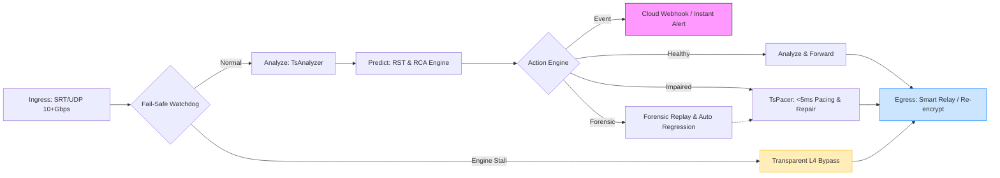

# Product Overview: TsAnalyzer & TsPacer

> **Note**: All technical abbreviations (RST, MDI, T-STD, etc.) are defined in Section 1.1.

## 1. Core Positioning & Glossary

TsAnalyzer and TsPacer together form an **OTT Smart Link Assurance Gateway**. The mission is to provide **Instrument-Grade Metrology** within a high-density, multi-tenant cloud architecture. We focus on **Content-Aware Integrity**, natively supporting **MPTS, SPTS, and ES-level inspection**.

### 1.1 Glossary of Terms
* **TR 101 290 (P1/P2/P3):** Industry standard for DVB system health.
* **MDI (Media Delivery Index):** Quantifies IP network health (DF:MLR).
* **RST (Remaining Safe Time):** Predictive metric for survival seconds.
* **T-STD (Transport System Target Decoder):** Buffer model for player stability.
* **Smart Forwarding & Inline Proxy:** Metrology-driven relay with active repair and fail-safe pass-through.
* **SRT Encryption (AES):** Transport-layer encryption rendering the entire packet opaque.
* **TS Scrambling (CAS/BISS):** Payload-only encryption where TS headers and PCR remain clear.

---

## 2. Encryption & Visibility Matrix

To accommodate secure cloud workflows, TsAnalyzer supports three levels of analysis based on available decryption keys:

| Visibility Tier | Input State | Metrology Capability | Actionable Loop |
| :--- | :--- | :--- | :--- |
| **Level 1: Blind** | SRT-Encrypted (No Key) | MDI-DF/MLR, RTT, SRT Error Stats. | L4 Pacing & Forwarding. |
| **Level 2: Semi-Blind** | TS-Scrambled (Payload Enc) | **TR 101 290 P1 & P2**, PCR Jitter, RST Prediction. | Pacing + Predictive Alarms. |
| **Level 3: Full** | Clear / Decrypted | **Big Nine Full Suite** (GOP, AV-Sync, SCTE-35). | Full Closed-Loop Assurance. |

---

## 3. The Closed-Loop Workflow: Analyze, Predict, Control, Verify

Sitting "in the wire," the gateway ensures zero service disruption via a hardware-grade watchdog while executing deep analysis.

---

## 4. Deployment Architecture: The Inline Metrology Hub

### 4.1 Smart Relay & Inline Proxy (Production)
The system is positioned "in the wire" to perform deep metrology and real-time repair.
* **Smart Relay**: Ingests SRT/UDP, applies TsPacer rate shaping, and forwards to destinations.
* **Fail-Safe**: L4 Bypass ensures zero downtime even if the analysis engine stalls.
* **SLA & Content Vitals**: Real-time reporting of transport quality (SRT) and content integrity (GOP/AV-Sync).

### 4.2 CLI / Ad-hoc Mode
Quick-start diagnostic tool for local files or multicast segment validation.

---

## 5. Technical Specification & Metrology Scope

### 5.1 TsAnalyzer: The Metrology Brain
* **Standards Compliance**: Full support for **ETSI TR 101 290 Priority 1, 2, and 3**.
* **IP Health**: Real-time **MDI (DF:MLR)** calculation.
* **Logical T-STD**: 1ms granularity simulation of TB, MB, and EB buffers.
* **ES Audit**: AV-Sync, **GOP Jitter**, and metadata (HDR/SCTE-35) extraction.

### 5.2 Performance Benchmark (Per 16-Core Node)
| Metric | Target | Notes |
| :--- | :--- | :--- |
| **Max Throughput** | 10+ Gbps | Aggregate with AES and ES analysis. |
| **Relay Latency** | < 100us | Total overhead added by inline metrology. |
| **Concurrency** | 1000+ streams | Supported by O(1) StreamID routing. |

---

## 6. Killer Capabilities: The Unified "Big Nine"

1. **TR 101 290 & MDI Metering**: Industrial-grade compliance and IP-layer health.
2. **Remaining Safe Time (RST)**: Predictive survivability (100ms refresh).
3. **Smart Forwarding & Relay**: Repair-then-Relay with integrated pacing.
4. **Transparent Failover**: L4 bypass ensures zero downtime.
5. **ABR-Ready Content Audit**: **GOP Jitter** and **IDR alignment** tracking.
6. **Secure Cloud Relay**: AES-128/256 decryption and re-wrapping.
7. **Automated RCA**: Instant isolation of Network vs. Encoder issues.
8. **SLA & Webhooks**: Real-time SLA reporting and event-driven callbacks.
9. **Automated Forensic Bundle**: capture of raw TS + trace logic for any fault.

---

## 7. Design Principles: Cloud-Native Elasticity
* **Kubernetes Integration**: HPA scaling based on aggregate Gbps analysis load.
* **Self-Healing**: Isolated segment auto-recovery in **< 50ms**.
* **Resource Bounding**: Strictly ~50 MB RSS per stream via zero-copy memory pools.

---

## Appendix A: Competitive Differentiation

| Vector | Legacy Instruments | Smart Gateway (TsA+TsP) |
| :--- | :--- | :--- |
| **Architecture** | Side-path (Passive) | **Inline (Active Participant)** |
| **OTT Packaging** | Passive Analysis | **ABR-Ready GOP/IDR Audit** |
| **Security** | Static / Clear | **SaaS-Ready (AES + JWT)** |
| **Reliability** | Fixed Hardware | **K8s Elastic + L4 Bypass** |
| **Cost Model** | High CapEx | **Low OpEx (Commodity Cloud)** |
