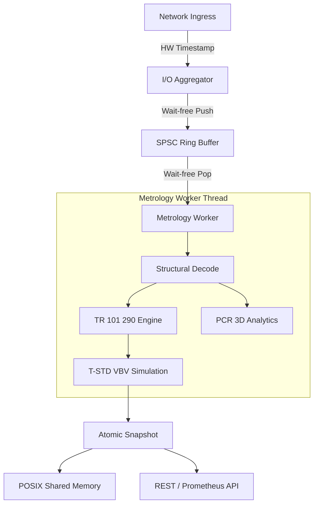

# System Architecture & Data Flow

TsAnalyzer v3 utilizes a decoupled, high-concurrency architecture optimized for NUMA-local execution and cache residency.

## 1. The 4-Layer Engine Architecture

The core analysis engine follows a strict linear pipeline to ensure temporal fidelity.

| Layer | Responsibility | Mechanism |
| :--- | :--- | :--- |
| **4. Interface** | Presentation | Bit-exact JSON, Prometheus Exporter, `tsa_top` TUI. |
| **3. Metrology** | Mathematical Simulation | ETSI TR 101 290, 3D PCR Math, T-STD (Leaky Bucket). |
| **2. Structural** | Protocol Decoding | SI/PSI Parsing, 27MHz STC Reconstruction, NALU Sniffing. |
| **1. Ingestion** | Physical Capture | Hardware Timestamping, recvmmsg Batching, SPSC Rings. |

---

## 2. Multi-Channel Threading Model (The Appliance)

To scale to 500+ streams, the Appliance employs a **Hybrid Reactor-Worker Model**:

1.  **I/O Aggregator (The Reactor)**: A small set of threads using Epoll to listen to hundreds of sockets. They perform raw packet reception and dispatch to stream-specific queues.
2.  **Metrology Worker (The Engine)**: One dedicated physical core per high-bitrate stream (or shared for proxy streams).
    *   **Lock-Free Handoff**: Data moves from Aggregator to Worker via a wait-free SPSC ring buffer.
    *   **CPU Pinning**: Workers are pinned to isolated cores to eliminate scheduling jitter.

---

## 3. Data Flow: Ingress to Insight

## 4. NUMA Integrity
In professional deployments, the system enforces **Local-Node Consistency**:
*   NIC Interrupts + Aggregator Thread + SPSC Buffers + Worker Threads + Metric Registry MUST all reside on the same physical CPU socket (NUMA node) to eliminate cross-bus Infinity Fabric/QPI latency.
