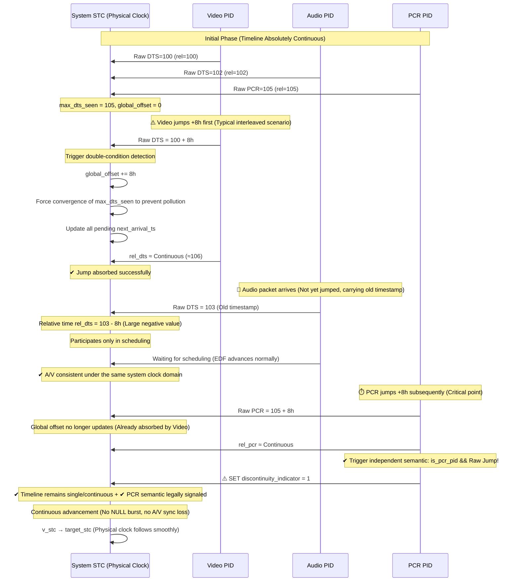

# Timestamp Discontinuity & CBR Synchronization Design

## 1. Core Principle: Unified Global System Time Domain

In the ISO/IEC 13818-1 standard, all PES / ES / PCR must strictly share the same System Time Clock (STC) reference system. Therefore, the T-STD engine completely abandons the Per-PID independent timeline scheme that breaks system consistency, and instead adopts the industrial-grade correct model of **"Global Offset Dynamic Re-anchoring + Raw Absolute Time Double-Condition Detection"**.

- **STC (System Time Clock)**: A system-level continuous clock driven by underlying physical packet bytes.
- **Target Time (target_stc)**: `target_stc = max_dts_seen - mux_delay`.
- **All Scheduling (EDF, Token Bucket, TB_n)**: Based on the global continuous **"Relative Timeline (`rel_dts`)"** after subtracting the offset.

---

## 2. Core Architectural Design (Industrial Model V3/V4)

To balance "System Timeline Continuity" and "PCR Semantic Consistency", the system implements the following mechanism decoupling:

### 2.1 Introduction of Raw Absolute Timeline (`last_dts_raw`)
Each PID must record its **True Absolute Timestamp (`last_dts_raw`)**, unmodified by any offset. This is the only baseline for accurately identifying real physical stream jumps and the prerequisite for triggering independent PCR semantics.

### 2.2 Double-Condition Jump Detection
When any PID in an interleaved stream arrives, double detection is performed:
1. **Per-Stream Physical Jump (Raw Jump)**: `FFABS(input_dts - pid->last_dts_raw) > THRESHOLD`
2. **Global Relative Drift**: `FFABS(rel_dts - tstd->max_dts_seen) > THRESHOLD`

**Only when both conditions are met** does it signify a new major jump not yet absorbed by the global offset.

### 2.3 Decoupled PCR Semantic Signaling
After the jump is absorbed by the global offset, the system internal remains continuous. However, for downstream decoders, we must follow the specification and legally signal the interruption at the exact point where the **PCR PID** itself undergoes a real jump:
```c
if (is_pcr_pid && FFABS(input_dts - pid->last_dts_raw) > THRESHOLD) {
    pending_discontinuity = 1; // Triggered ONLY by PCR
}
```

---

## 3. Sequence Diagram: Interleaved Discontinuity Handling



## 4. V6 Architecture: The Upstream-Ready Philosophy (Soft Convergence)

To achieve the robustness required for the FFmpeg mainline, the V6 architecture evolves from "Deterministic Control" to **"State-Driven Soft Convergence"**.

### 4.1 Three-Layer Architectural Split
1.  **Detection Layer**: Pure observation. Tracks `last_dts_raw` and `delta_rel`. Implements a **Voter Mechanism**: A jump event is only promoted if multiple packets or different PIDs confirm the shift.
2.  **Policy Layer (State Machine)**:
    - `STATE_NORMAL`: Regular scheduling.
    - `STATE_CONFIRMING`: Potential jump detected; entering observation window without altering offsets.
    - `STATE_REALIGNING`: Jump confirmed. Decides between **Quantum Leap** (for >10s jumps in `-copyts` mode) or **Gradual Smooth** (for smaller drifts).
    - `STATE_STABILIZING`: Post-jump recovery; monitoring buffer health.
3.  **Action Layer**: Implements the decisions.
    - **Gradual Transition (Clock Stretching)**: Instead of an instant `stc_offset` jump, the system adjusts the physical STC by ±1ms per PCR packet over 100+ cycles until aligned.
    - **Scheduler Control**: Late packets are handled via **Delay or Drop** policies at the scheduler level, preserving original media DTS/PTS semantics.

### 4.2 Handling "Negative Time" (Late Data Clamping)
When a timeline shift occurs, interleaved packets "from the past" are clamped to `STC - margin` to prevent **TB_n Underflow** and EDF priority inversion, ensuring the Muxer does not stall trying to dump 8 hours of stale data.

## 5. Mathematical Model Validation (IRD Simulator)

To verify the V6 Model, a **Digital Twin** of a broadcast receiver (IRD) is used.

### 5.1 Validation Script
- **Path**: `scripts/tools/tstd_ird_simulator.py`
- **Logic**:
    1. **MuxerSim**: Implements the V6 dual-timeline, state-machine jump detection, and late data clamping.
    2. **IRD PLL**: Simulates a standard 2nd-order Phase-Locked Loop for STC recovery.
    3. **Buffer Model**: Simulates T-STD Video/Audio buffer occupancy.
- **Usage**: `python3 scripts/tools/tstd_ird_simulator.py`

### 5.2 Success Criteria
- **Zero Buffer Overflow/Underflow**: Proves timeline shifts are smooth for the decoder.
- **PLL Lock Continuity**: Proves `discontinuity_indicator` allows instantaneous receiver STC reset.
- **Interleaving Resilience**: Proves staggered jumps do not pollute global state.

## 8. Bitrate Enforcement & Scheduling Discipline

The T-STD engine transitioned from a "mechanical throttle" to a "mathematical admission" model to ensure strict CBR compliance even during massive timestamp discontinuities.

### 8.1 The Greedy Scheduler Problem (Legacy v9)
In early v9 iterations, the scheduler was "greedy": it would emit a payload packet as long as the Transport Buffer (TB_n) had space and tokens were available. When hardcoded caps were removed, this exposed a "Logic-only" scheduling flaw where packets were burst onto the wire at CPU speeds, ignoring physical bandwidth constraints and causing bitrate inflation (e.g., 2Mbps target becoming 8Mbps actual).

### 8.2 Physical Timeline Admission
To enforce strict CBR, the scheduler implements **Physical Timeline Admission**.
- **Rule:** A PID is only eligible for the physical bus if the virtual clock (`v_stc`) has reached or exceeded its scheduled `next_arrival_ts`.
- **Budgeting:** Transmission is governed by a **TX Budget** formula: `allowed_packets = (delta_stc * mux_rate) / (27MHz * TS_BITS)`.

---

## 9. The Monotonic Physical Flywheel (V9.4)

The definitive T-STD architecture adopts a **Monotonic Physical Flywheel** model, treating the muxer as a constant-speed conveyor belt that never stops or reverses.

### 9.1 The Monotonicity Rule
The virtual system clock (`v_stc`) is **strictly monotonic**. Even if input timestamps undergo a massive negative jump (Rollback), the flywheel continues to rotate forward at a minimum pace (e.g., 1ms per drive cycle), bridging the time gap with NULL packets and signaling `discontinuity_indicator`.

### 9.2 Per-Packet Clock Gating
For every TS packet emitted—whether PCR, Payload, or NULL—the virtual clock advances by a fixed increment:
`STC_PER_PACKET = (188 * 8 * 27,000,000) / mux_rate`
This ensures the physical byte-count and the temporal clock are perfectly coupled.

### 9.3 Priority Hierarchy
Within the drive loop, the scheduler follows a strict priority chain:
1.  **PCR Timer**: Force-inject PCR if `v_stc` reaches the next PCR deadline.
2.  **Weighted Pacing**: Emit payload ONLY if the PID has accumulated tokens for at least one full packet.
3.  **Stuffing Stabilizer**: Emit NULL packets if no payload is ready or pacing budget is exhausted, maintaining the constant Muxrate.

### 9.4 Evolution Log
- **v9.0**: Greedy admission, hidden by 5000-step mechanical cap.
- **v9.1**: Adaptive steps introduced; exposed greedy scheduling, causing bitrate inflation.
- **v9.4 (Current)**: **Physical Flywheel 2.0** implemented. Muxrate enforced via monotonic STC budget and per-packet gating.
