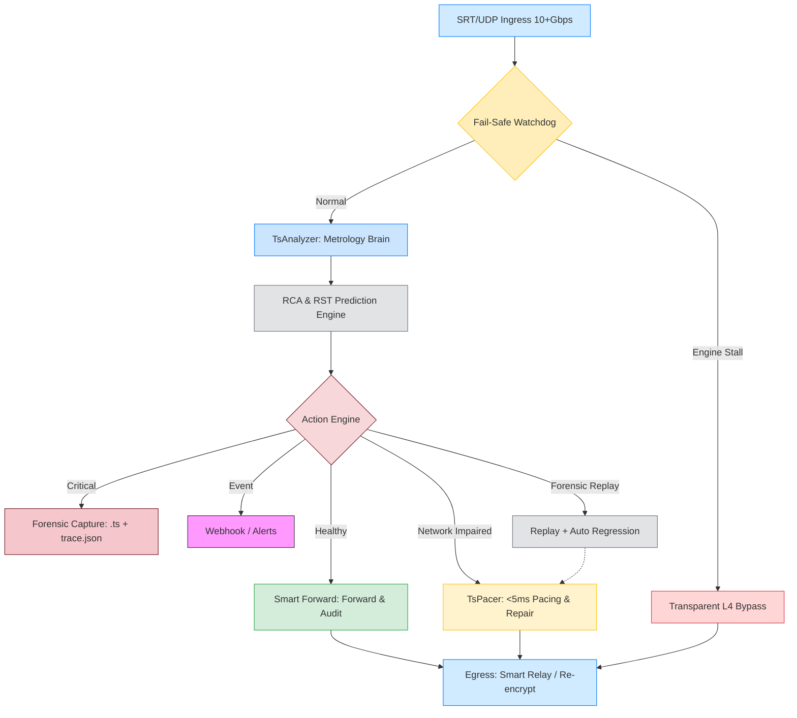
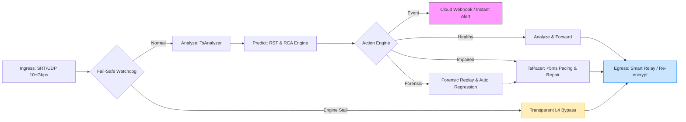

# TsAnalyzer Pro: System Architecture & Functional Maps

This document provides multi-level visual representations of the TsAnalyzer Pro ecosystem.

---

## 1. Hierarchical Operational Flow (Core Logic)
*Goal: Clear visualization of the decision-making hierarchy and system paths.*



### Functional Mapping:
- **Ingress**: Physical SRT/UDP stream ingest.
- **Watchdog**: Real-time safety guard triggering L4 Bypass on latency spikes.
- **TsAnalyzer**: Core metrology engine (TR 101 290, MDI, T-STD, ES Audit).
- **RCA & RST Engine**: Root cause attribution and survival horizon prediction.
- **Action Engine**: Decides between healthy forwarding, pacing repair, or forensic capture.
- **TsPacer**: Real-time traffic shaping and jitter neutralization.
- **Forensic Capture**: Automated .ts and trace.json generation for critical faults.
- **Egress**: Final destination delivery with optional re-encryption.
- **Webhook & Replay**: Event callbacks and automated regression testing.

---

## 2. Core Closed-Loop Workflow (Compact LR)
*Goal: Quick understanding of the Analyze-Predict-Control-Verify cycle.*



---

## 3. End-to-End Functional Map (Detailed Flow)
*Goal: Detailed visualization of metrics flow, decision logic, and dashboard mapping.*

```mermaid
flowchart TD
    %% ======================
    %% Ingress Layer
    %% ======================
    subgraph INGRESS ["Ingress Layer: SRT / UDP Streams"]
        direction LR
        S1[Stream A] --> WD[Watchdog]
        S2[Stream B] --> WD
        S3[Stream C] --> WD
    end

    %% ======================
    %% Analyzer & Metrics
    %% ======================
    subgraph ANALYZER ["TsAnalyzer Engine & Metrics"]
        direction TB
        WD --> AN[Multi-Tier Analyzer<br>(Blind / Semi-Blind / Full)]
        AN --> DF[Delay Factor (DF)]
        AN --> MLR[Media Loss Rate (MLR)]
        AN --> RSTN[RST Network Health]
        AN --> RSTE[RST Encoder Health]
        AN --> TSTD[T-STD: PID Buffer %]
        AN --> GOP[GOP Jitter ms]
        AN --> AVS[AV-Sync ms]
        AN --> SCTE[SCTE-35 Events]
    end

    %% ======================
    %% Action Engine
    %% ======================
    subgraph ACTION ["Action Engine: Smart Decision"]
        direction TB
        AN --> ACT{Decision Logic}
        ACT -->|Healthy| FW[Forward / Direct Pass-Through]
        ACT -->|Network Turbulence| PAC[TsPacer: Pacing <5ms]
        ACT -->|Encoder Degradation| ALERT[Forward + Alert]
        ACT -->|Critical Failure| FRS[Automated Forensic Capture]
    end

    %% ======================
    %% Egress Layer
    %% ======================
    subgraph EGRESS ["Egress Layer: Smart Relay / Re-encrypt"]
        FW --> EGR[Egress]
        PAC --> EGR
        ALERT --> EGR
        FRS --> EGR
    end

    %% ======================
    %% Event / Webhook
    %% ======================
    ACT --> WH[Webhook / CI-CD / RCA Event]

    %% ======================
    %% Dashboard Panels
    %% ======================
    subgraph DASHBOARD ["NOC Dashboard: Survival-First View"]
        direction TB
        DF --> MDI_W[MDI Waveform Trend]
        MLR --> MDI_W
        GOP --> GOP_W[GOP Jitter Chart]
        TSTD --> TSTD_W[T-STD Heatmap]
        AVS --> AVS_W[AV-Sync Timeline]
        SCTE --> SCTE_W[SCTE-35 Timeline]
        PAC --> PAC_G[TsPacer Intensity Gauge]
        RSTN --> RST_W[RST Countdown: Network]
        RSTE --> RST_E[RST Countdown: Encoder]
    end

    %% ======================
    %% Styling
    %% ======================
    style INGRESS fill:#e0f7fa,stroke:#00acc1,stroke-width:2px
    style ANALYZER fill:#f1f8e9,stroke:#8bc34a,stroke-width:2px
    style ACTION fill:#fff3e0,stroke:#ff9800,stroke-width:2px
    style EGRESS fill:#e3f2fd,stroke:#2196f3,stroke-width:2px
    style DASHBOARD fill:#f3e5f5,stroke:#9c27b0,stroke-width:2px
    style WH fill:#fce4ec,stroke:#e91e63,stroke-width:2px
```
