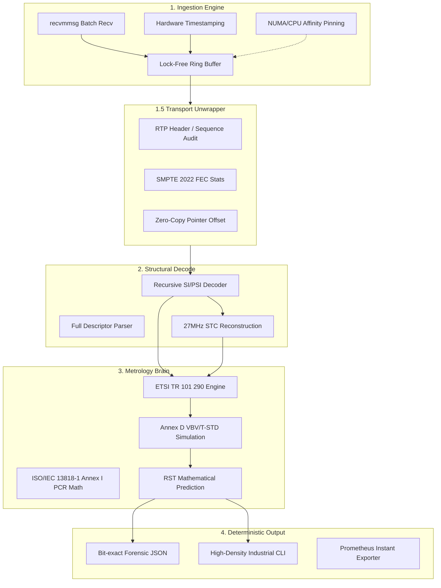

# TsAnalyzer: 4-Layer Engine Architecture

The architecture is designed for **Linear Scaling** and **Deterministic Processing**. Every module is optimized to keep the data in the L1/L2 cache and minimize cross-core synchronization.

---

## 1. Engine Architecture Diagram

---

## 2. Low-Level Implementation Principles

### Layer 1: Ingestion Engine
*   **Hardware Timestamping**: Utilizes `SO_TIMESTAMPING` to get NIC-level arrival times.
*   **Linear Ownership & Zero-Copy**: Packets move through the pipeline via **Linear Pointer Transfer** with zero memory-to-memory copies. A stage loses write access immediately after passing the packet to the next.
*   **NUMA Alignment**: Ring buffers and processing threads are pinned to the same physical NUMA node.

### Layer 2: Structural Decode
*   **AU Abstraction**: Reassembles PES into **Access Units (AU)**, providing the atomic input for the metrology brain.
*   **STC Reconstruction**: Rebuilds the **VSTC** axis derived exclusively from PCR and **Hardware Arrival Time (HAT)**.
*   **Stateful Parsing**: Tracks SI/PSI version numbers to trigger recursive re-parsing only when necessary.

### Layer 3: Metrology Brain
*   **Atomic Evaluation**: T-STD simulation is driven by AU arrival and DTS removal events on the **VSTC** timeline.
*   **Deterministic FSM**: TR 101 290 checks and **Annex D Buffer Models** are implemented as strict state machines with no random-access memory patterns.
*   **Fixed-Point Math**: All calculations use deterministic fixed-point arithmetic to ensure bit-identical results across architectures.

### Layer 4: Deterministic Output
*   **Reproducibility Guard**: Output generation is strictly decoupled from system wall-clock. All timestamps in the JSON report are either STC-based or Capture-relative.
