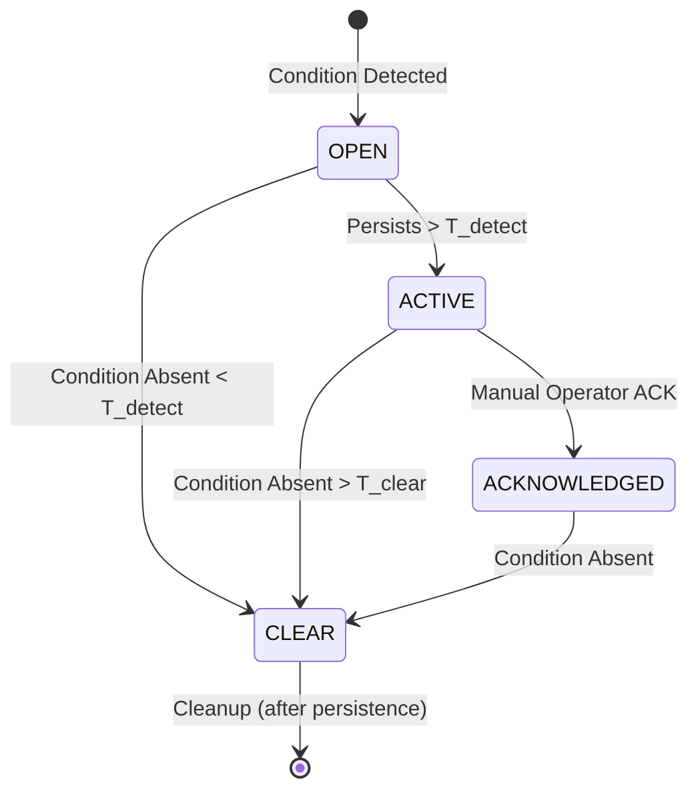

# Technical Spec: Alarm Lifecycle Engine (Layer 4)

The Alarm Lifecycle Engine is responsible for transforming instantaneous "Events" from the Analysis Core (Layer 3) into stateful, managed "Alarms" with a clear lifecycle, duration, and evidence.

---

## 1. Alarm State Machine (FSM)

Every alarm follows a strictly defined state transition model to ensure operational clarity and prevent flapping.



### State Definitions:
- **OPEN**: Initial trigger state. The engine captures the first "Evidence" and starts the `T_detect` timer.
- **ACTIVE**: The fault is confirmed. This state triggers external notifications (Webhooks, SNMP).
- **ACKNOWLEDGED**: The operator has acknowledged the fault. Escalation timers are stopped, but the alarm remains until the condition clears.
- **CLEAR**: The condition has been absent for `T_clear`. Final duration is calculated and the incident is closed.

---

## 2. Core Data Structure (`tsa_alarm_t`)

To ensure forensic-grade traceability, the alarm object contains bit-exact context and versioning.

```c
typedef struct {
    uint64_t alarm_id;           // Unique monotonic ID
    char stream_id[64];          // Target stream identifier
    uint32_t error_code;         // e.g., TR_101_290_P1_1
    uint8_t severity;            // CRITICAL, MAJOR, MINOR, WARNING

    // Lifecycle States
    uint8_t state;               // OPEN, ACTIVE, ACK, CLEAR
    stc_27m_t start_time;        // First detected (Deterministic STC)
    stc_27m_t active_time;       // Moved to ACTIVE
    stc_27m_t ack_time;          // When user acknowledged
    stc_27m_t clear_time;        // When condition disappeared

    // Forensic Evidence (Layer 3 Context)
    struct {
        uint64_t packet_offset;  // Byte offset in the stream
        uint16_t pid;            // Impacted PID
        char raw_data[256];      // JSON-encoded bit-exact evidence
    } evidence;

    // Metadata for Compliance
    char engine_version[16];     // analysis_engine_version
    uint32_t schema_id;          // metrics_schema_version
} tsa_alarm_t;
```

---

## 3. Timing & Hysteresis Logic

Professional monitoring requires immunity to "chatter" (rapidly toggling states).

- **T_detect (Debounce)**: Default `3000ms`. An error must be present continuously for this duration before becoming `ACTIVE`.
- **T_clear (Stability)**: Default `5000ms`. A condition must be absent continuously for this duration before an alarm is moved to `CLEAR`.
- **Clock Baseline**: All timing is calculated using the reconstructed **27MHz STC** for File/Live modes, ensuring bit-exact results during re-analysis.

---

## 4. Evidence Binding Mechanism

When an alarm transitions to **OPEN**, Layer 4 issues a `CAPTURE_EVIDENCE` request to Layer 3:
1.  **Bit-stream Snapshot**: Layer 3 provides the exact values (e.g., `expected_CC=5, actual_CC=7`).
2.  **Context Link**: The alarm stores the current `engine_version`.
3.  **Reproducibility**: This evidence allows an engineer to find the exact packet in a PCAP file and verify the math.

---

## 5. Persistence & Integration

- **In-Memory Store**: Layer 4 maintains an O(1) active alarm table indexed by `(stream_id, error_code)`.
- **Event Bus**: Every state transition generates a **Change Event** sent to Layer 6 (Presentation/API).
- **History Sync**: Once an alarm reaches `CLEAR`, the final record is pushed to Layer 5 (State & History Engine) for SLA calculation.

---

## 6. Sencore-Style SLA Impact

Only alarms in the **ACTIVE** or **ACKNOWLEDGED** states contribute to "Service Downtime."
- **Downtime Duration** = `clear_time - active_time`
- **SLA Calculation**: `(Uptime / Total_Window) * 100`
