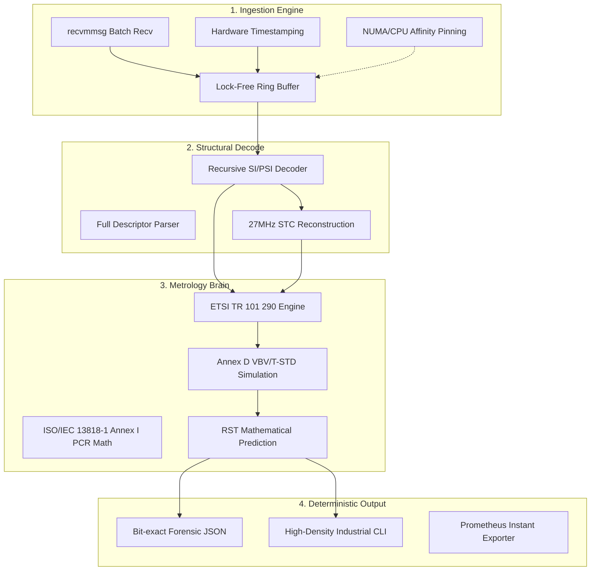

# TsAnalyzer Pro: Product & Architecture Blueprint

> **Engineering Identity**: TsAnalyzer is a professional-grade **Software-Defined Measurement Instrument**. It is built to provide bit-exact metrology for Transport Streams at 1Gbps, where every measurement is experimentally verifiable and reproducible.

---

## 1. Product Mission & Positioning

TsAnalyzer is a **Broadcast-Grade Deterministic Monitoring System**. It provides absolute metrology, stateful alarm lifecycle management, and long-term compliance (SLA) auditing. It acts as a **High-Performance "Surgical Blade"** for Transport Streams, enforcing **Temporal Fidelity Preservation** to ensure that the software simulation of the delivery path is immune to the non-determinism of modern OS scheduling.

### 1.1 Technical Foundations
*   **Timing Authority**: All internal metrology calculations are derived exclusively from `CLOCK_MONOTONIC_RAW` or the **NIC Hardware Timestamp domain**. System wall-clock adjustments (NTP) are strictly excluded from analysis timing paths.
*   **Deterministic Accuracy**: Bit-exact reproducibility. Replaying a PCAP through the engine must yield identical results across multiple runs.
*   **1Gbps Processing Architecture**: Optimized for **1.2M PPS per core** using batch reception (`recvmmsg`), CPU affinity, and **NUMA-local memory allocation**.
*   **Zero-Copy Data Plane**: Utilizes a **Lock-free SPSC ring buffer** with cache-line aligned packet descriptors.

---

## 2. 4-Layer Engine Architecture

The architecture is designed for **Linear Scaling** and **Deterministic Processing**. Every module is optimized to keep the data in the L1/L2 cache and minimize cross-core synchronization.

| Layer | Responsibility | Implementation Principles |
| :--- | :--- | :--- |
| **4. Deterministic Output** | Interface | Forensic JSON (Bit-exact), High-density Industrial CLI, Prometheus Exporter. |
| **3. Metrology Brain** | Math & Standards | ETSI TR 101 290 (P1/P2/P3), ISO/IEC 13818-1 (Annex I/D), T-STD Simulation. |
| **2. Structural Decode** | Protocol Depth | Full PSI/SI (PAT/PMT/NIT/SDT/EIT), 27MHz STC Reconstruction, Access Unit (AU) assembly. |
| **1. Ingestion Engine** | Capture | **Hardware Timestamping**, recvmmsg Batching, NUMA-local SPSC Ring Buffers. |

### 2.1 System Data Flow

---

## 3. Operational Modes & Authority

TsAnalyzer defines multiple operational modes to determine the **Measurement Authority** of the results. Every analytical report MUST declare its mode.

| Mode | Purpose | Timing Authority | Trust Level |
| :--- | :--- | :--- | :--- |
| **Live Capture** | Real-time monitoring | Physical + HAT | **Operational** |
| **Deterministic Replay**| Laboratory analysis | Recorded HAT | **Reproducible** |
| **Forensic** | Incident investigation | Immutable Input | **Evidential** |
| **Certification** | Vendor acceptance | Hardware Stamped | **Instrument-grade** |

> **Note**: Certification Mode requires strict environment enforcement: `isolcpus`, fixed CPU frequency, and NUMA locality pinning.

---

## 4. Functional Capability Matrix

### 4.1 Physical & Transport Layer
*   **Ingest**: UDP/RTP, SRT (Caller/Listener), PCAP Replay, HLS/HTTP (Planned).
*   **Metrology**: MDI (RFC 4445), IAT Histograms (Micro-burst detection).
*   **Grooming**: Bitrate Smoother (CBR Reshaping via `clock_nanosleep`).

### 4.2 Protocol Compliance (TR 101 290)
*   **P1/P2**: Full coverage (Sync, PAT, CC, PMT, PCR Accuracy, PTS Error, etc.).
*   **P3/Metadata**: Version tracking for PAT/PMT/SDT/NIT. SCTE-35 Audit (Splice vs. I-Frame PTS).

### 4.3 Content & Clock Analytics
*   **Clock**: Software PLL, 3D PCR Decomposition (AC/DR/OJ), Walltime Drift Regression.
*   **ES Analysis**: Zero-Copy NALU Sniffer (H.264/H.265), GOP Tracking, T-STD Buffer Model.
*   **Forensics**: Triggered Micro-Capture (500ms TS dump), Webhook Signaling (Planned).

---

## 5. Industrial Features

### 5.1 Alarm Lifecycle Management
Detected faults follow a strict Finite State Machine:
`OPEN` (Detect) -> `ACTIVE` (Persist > 3s) -> `ACKNOWLEDGED` (Manual) -> `CLEARED` (Absent > 5s).

### 5.2 Forensic "Black Box"
When a critical P1/P2 error is detected, TsAnalyzer automatically freezes its rolling 500ms buffer and flushes it to disk, providing unambiguous evidence for Root Cause Analysis (RCA).

### 5.3 Success Criteria (Verification Gates)
*   **G1**: 1.0 Gbps aggregate throughput with zero kernel drops.
*   **G2**: 100% TR 101 290 P1/P2 coverage; ±10ns PCR jitter precision.
*   **G3**: MD5-consistent JSON output for identical PCAP input.
*   **G4**: 24h stability with zero memory growth (RSS flat-line).
