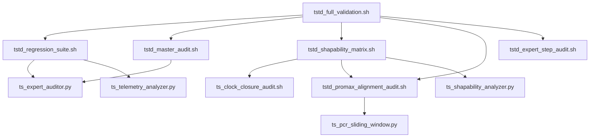

# T-STD Multiplexer Metrology & Validation Suite

This directory contains the authoritative validation tools for the **V3 Modular T-STD Engine**. These tools ensure TR 101 290 compliance, physical layer smoothness, and long-term 24/7 stability.

---

## 1. Primary Entry Points (Standard Workflow)
Use these for release gating and general regression.

| Script | Level | Purpose |
| :--- | :--- | :--- |
| **`tstd_full_validation.sh`** | **L3 (Release)** | **Final Gate.** Executes the full spectrum of metrics including UDP, Matrix, and Expert Dynamics. |
| **`tstd_regression_suite.sh`** | **L2 (CI/CD)** | **Logic Regression.** 17 Phases covering Voter, Scheduler, Wrap-around, and Pacing. |
| **`tstd_master_audit.sh`** | **L1 (Bench)** | **Throughput Matrix.** Benchmarks bitrate precision (SCORE) across various muxrates. |

---

## 2. Specialized Industrial Audits
Targeted validation for specific physical layer components.

### 2.1 Control Theory & Dynamics
*   **`tstd_expert_step_audit.sh`**: **(Expert)** Quantifies Slew-Rate limiting and PI-controller convergence during bitrate spikes (Step Response).
*   **`tstd_modular_audit.sh`**: Direct verification of Voter consensus streaks and Scheduler L1 preemption tiers.
*   **`tstd_shapability_matrix.sh`**: Hard-requirement audit for the **84kbps Bitrate Delta** envelope.

### 2.2 Compliance & Resilience
*   **`tstd_srt_native_audit.sh`**: **(Bit-accurate)** Proves SRT P2P transparency. Ensures MD5 consistency before and after SRT transport.
*   **`tstd_srt_srs_audit.sh`**: **(Relay Audit)** Verifies physical metrics (±44k) after SRS middle-box forwarding.
*   **`tstd_psi_audit.sh`**: Verifies SI/PSI intervals (PAT/PMT/SDT) against DVB/ATSC standards using TSDuck.
*   **`tstd_udp_stability.sh`**: Real-time loopback stress test to measure PCR jitter and network-layer pacing.
*   **`tstd_jump_audit.sh`**: Stress tests the Voter system against massive source-level timestamp discontinuities.
*   **`tstd_ai_filter_stress.sh`**: Verifies physical stability when using heavy AI-preopt filters (FaceMask/MNN).
*   **`tstd_chaos_audit.sh`**: Simulates random packet loss and jitter to verify "Laminar Flow" survival.

---

## 4. Script Dependency Tree (Management Map)
To prevent accidental deletion, understand the hierarchy.

**Naming Convention:**
- `tstd_xxx`: Orchestrators, Regression Suites, and Test Scenarios.
- `ts_xxx`: Underlying Auditors, Engines, and Analysis Tools.



### Dependency Tags in Files:
- **`[CORE ENGINE]`**: Never delete. Found in `ts_expert_auditor.py` and `ts_pcr_sliding_window.py`.
- **`[INTERNAL DEPENDENCY]`**: Required by L3/L2 orchestrators.

---

## 5. Maintenance & Archival (Legacy)


The following scripts are considered **Legacy (V1/V2)** and should not be used for V3 validation:
- `tstd_smoke_test.sh`: Integrated into Regression Phase 1.
- `tstd_auto_audit.sh`: Replaced by Master Audit.
- `tstd_30s_audit.sh`: Superseded by High-Precision Matrix Audit.
- `gen_v1_golden.sh`: Manual artifact, deprecated.

---

## 5. Standard Operating Procedure (SOP)

### Release Validation
```bash
# 1. Export License
export WZ_LICENSE_KEY="/path/to/wz_license.key"

# 2. Run Full Spectrum
./tstd_full_validation.sh
```

**Note:** For 1080p_high (4000k) specific audits, refer to `tstd_expert_step_audit.sh`.
